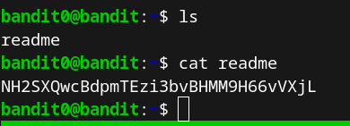
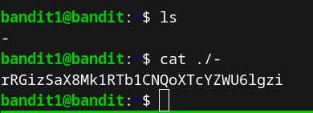
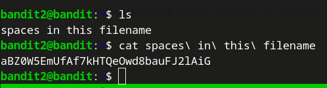
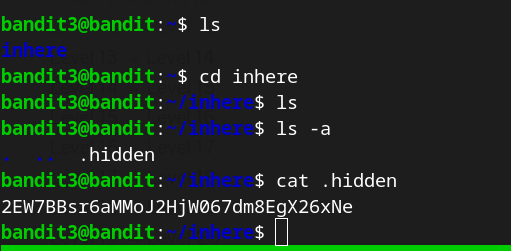

### Level 0 &rarr; Level 1  
Once connected to **bandit0**, the password for the next level can be found in the **readme** file in the home directory.  
To display the contents of the file, run the following command: **cat readme**  
  
  

    **User:** bandit1  
    **Password:** NH2SXQwcBdpmTEzi3bvBHMM9H66vVXjL  
      
-------------------------------------------------------------------
### Level 1 &rarr; Level 2  
After logging into **bandit1**, the password is stored in a file named "-". To view the contents of the file,  
we need to specify the full path to it: **cat ./-**  
  
  
    
> **User:** bandit2
> **Password:** rRGizSaX8Mk1RTb1CNQoXTcYZWU6lgzi  
      
-------------------------------------------------------------------
### Level 2 &rarr; Level 3
After logging into **bandi2**, the password is in a file in the home directory. The file name contains spaces,  
so to view the content of the file, we need to escape the spaces using the back-slach escape character: **cat spaces\ in\ this\ filename**  
  
  

> **User:** bandit3
> **Password:** aBZ0W5EmUfAf7kHTQeOwd8bauFJ2lAiG  

-------------------------------------------------------------------
### Level 3 &rarra; Level 4
As indicated on the website, the password is stored in a hidden file in the **inhere** directory, so I performed the following actions:  
- change location to the inhere directory: **cd inhere**  
- display directory contents, including hidden directories and files: **ls -a**  
- display contents of hidden file: **cat .hidden**  

    **User:** bandit3
    **Password:** 2EW7BBsr6aMMoJ2HjW067dm8EgX26xNe  
