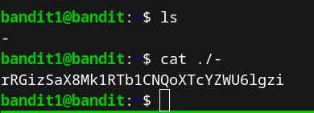
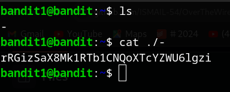

### Level 0 &rarr; Level 1  
Once connected to **bandit0**, the password can be found in the **readme** file in the home directory. To display the contents of the file, run the following command: **cat readme**  

-------------------------------------------------------------------
### Level 1 &rarr; Level 2  
After logging into bandit1, the password is stored in a file named "-". To view the contents of the file, we need to specify the full path to it: **cat ./-**  

-------------------------------------------------------------------
