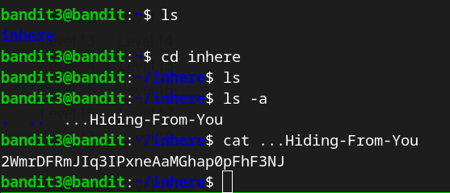
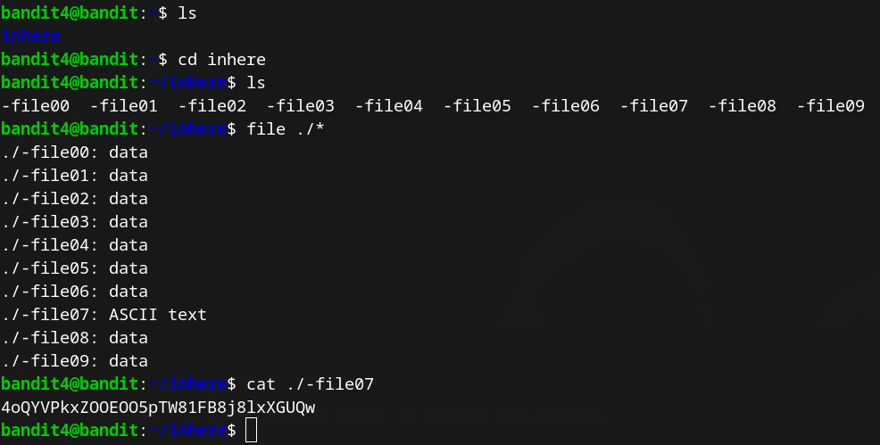

### Level 0 &rarr; Level 1  
Once connected to **bandit0**, the password for the next level can be found in the **readme** file in the home directory.
To display the content of the file, run the following command: **cat readme**  
  
  

    User: bandit1
    Password: NH2SXQwcBdpmTEzi3bvBHMM9H66vVXjL  
      
-------------------------------------------------------------------
### Level 1 &rarr; Level 2  
After logging into **bandit1**, the password is stored in a file named "-". To view the contents of the file,
we need to specify the full path to it: **cat ./-**  
  
  
    
    User: bandit2  
    Password: rRGizSaX8Mk1RTb1CNQoXTcYZWU6lgzi  
      
-------------------------------------------------------------------
### Level 2 &rarr; Level 3
After logging into **bandi2**, the password is in a file in the home directory. The file name contains spaces, so to view the content
of the file, we need to escape the spaces using the back-slach escape character: **cat spaces\ in\ this\ filename**   
  
  

    User: bandit3  
    Password: aBZ0W5EmUfAf7kHTQeOwd8bauFJ2lAiG  

-------------------------------------------------------------------
### Level 3 &rarr; Level 4
As indicated on the website, the password is stored in a hidden file in the **inhere** directory, so I performed the following actions:  
- Change location to the **inhere** directory: **cd inhere**  
- Display directory content, including hidden directories and files: **ls -a**  
- Display content of the hidden file: **cat .hidden**  

    User: bandit4
    Password: 2EW7BBsr6aMMoJ2HjW067dm8EgX26xNe  

-------------------------------------------------------------------
### Level 4 &rarr; Level 5
Once connected to **bandit4**, the password is stored in the only human-readable file in the **inhere** directory (as mentioned
on the website). I changed the location to **inhere** directory and listed the contents of the directory, I see that there are
many files starting with **-file** followed by a number, in order to identify the human-readable file, I executed this command
which tells me the type of each file: <strong>file ./*</strong> 
I can see that the file **-file07** is the right one, so I printed its contents.
  

    User: bandit5
    Password: lrIWWI6bB37kxfiCQZqUdOIYfr6eEeqR
  
-------------------------------------------------------------------
### Level 5 &rarr; Level 6
The instructions on the website clearly indicated that the password is stored somewhere in the **inhere** directory in a file 
with the following characteristics:  
- human-readable
- 1033 bytes in size
- not executable
Here are the steps I followed:  
- Find the file in the current directory with a size of 1033 bytes with the following command: **du -ab | grep 1033**
- Check file permissions, it must not be executable: **ls -l inhere/maybehere07/.file02**
- Check whether the file contains human-readable data (text): **file inhere/maybehere07/.file02**
  

    User: bandit6
    Password: P4L4vucdmLnm8I7Vl7jG1ApGSfjYKqJU
